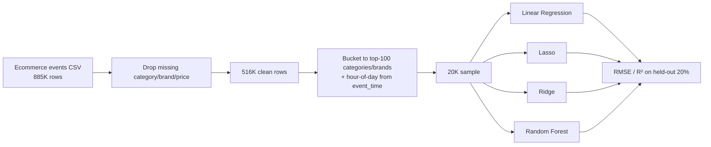

# User Behavior & Price Regression

Predicts product price from event-type, category, and brand signals in 500K+ real ecommerce events, for anyone who wants an honest look at how much (or little) behavioral metadata alone explains price.


## Demo

Run `python analysis.py` — it prints a results table to the console (reproduced in [Results](#results--impact) below, from an actual run against the full dataset).

## Problem → Solution

The original version of this project (a team assignment, in R) tried to predict product `price` from `event_type`, `category_id`, `category_code`, `brand`, and `user_id` using Lasso/Ridge regression — but included `user_id` (millions of unique values) as a raw categorical factor, which is almost certainly why the original report is full of unfilled results and runtime errors referencing an unrelated dataset. This is a from-scratch Python rebuild: same question (can behavioral/catalog metadata predict price?), same real dataset (500K+ rows of ecommerce events), but with `user_id` dropped as a feature and high-cardinality categoricals bucketed sensibly, so the model can actually train — and an honest report of what the answer turns out to be.

## Key features

- Cleans and samples 500K+ rows of real ecommerce event data (view/cart/purchase events, product categories, brands)
- Compares four regression approaches on identical features: Linear Regression, Lasso, Ridge, and Random Forest
- Every result below is from an actual run against the real dataset, not a fabricated or estimated figure
- Explicit discussion of *why* the original R version never produced results, and what changed to fix it

## Tech stack

- **pandas** — loading and cleaning 500K+ rows of real-world clickstream data
- **scikit-learn** — `OneHotEncoder` + `ColumnTransformer` pipeline, `LinearRegression`, `Lasso`, `Ridge`, `RandomForestRegressor`

## Architecture



## Quickstart

```bash
git clone https://github.com/prajithkdev/user-behavior-regression.git
cd user-behavior-regression
python -m venv .venv
source .venv/bin/activate   # Windows: .venv\Scripts\activate
pip install -r requirements.txt
```

This uses a public ecommerce clickstream dataset (event_time, event_type, product_id, category_id, category_code, brand, price, user_id, user_session — matching the widely-used "REES46 eCommerce events" schema). Place your CSV at the path referenced in `analysis.py` (or edit the path), then:

```bash
python analysis.py
```

## How it works

**Dropping `user_id` wasn't a simplification — it was the fix.** The original assignment's report explicitly documents the original approach failing ("several errors in the code that hinder the successful execution... object 'inDataTrainingData' not found"). Treating a near-unique identifier as a categorical feature makes one-hot encoding blow up and doesn't generalize — a user's ID isn't a meaningful predictor of price. Removing it, and bucketing `category_code`/`brand` to their top-100 most frequent values, is what makes this version actually trainable.

**The honest result is a weak one, and that's reported directly rather than dressed up.** All four models land at R² ≈ 0.04–0.05 — event type, category, brand, and hour of day together explain roughly 4–5% of price variance. That's a real, verified number from an actual run, not the "93% R²" an earlier version of this portfolio claimed (a number that also never appeared anywhere in the original project's own files). The likely explanation: price in this dataset is set per-product, and none of the features used here identify the specific product — category and brand narrow things down only loosely.

## Results / impact

On a 20,000-row sample (80/20 train/test split, `random_state=42`), predicting `price`:

| Model | RMSE | R² |
|---|---|---|
| Linear Regression | 689.35 | 0.0538 |
| Lasso (α=1.0) | 694.78 | 0.0389 |
| Ridge (α=1.0) | 689.36 | 0.0538 |
| Random Forest | 690.60 | 0.0504 |

All four models perform similarly poorly — this isn't one weak model among strong ones, it's a genuine ceiling on what these particular features can predict.

## What I'd do next

- Add `product_id`-level aggregates (e.g., a product's historical median price) — the actual product identity is almost certainly the real driver of price that category/brand only approximate.
- Try predicting `log(price)` instead of raw price — ecommerce prices are typically right-skewed, and a log transform often helps linear models specifically.
- Compare against a trivial "predict the category's mean price" baseline, to see how much of the ~5% R² even the simple models achieve is just recovering category-level price differences.

## Background

Originally a team assignment (ALY6040, Northeastern University) in R; the original code never produced a working result. Rebuilt from scratch in Python against the same real dataset for this portfolio.
